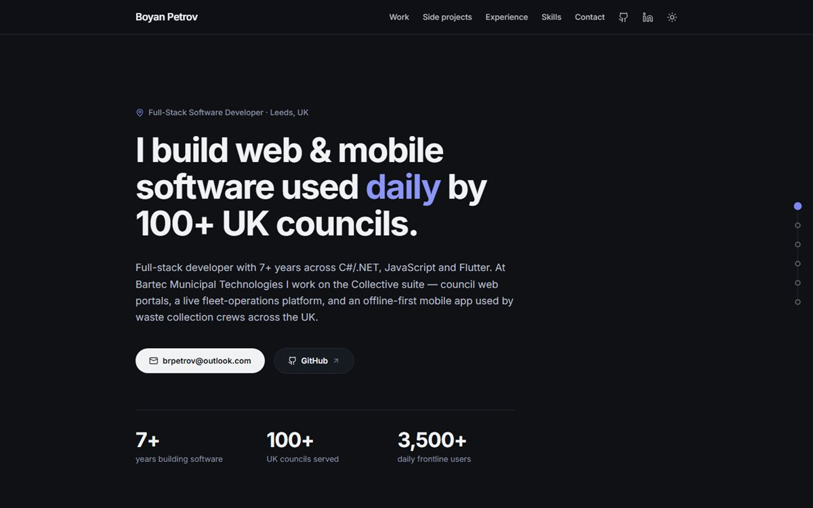
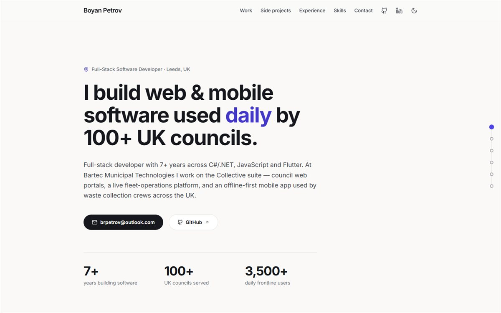

# Boyan Petrov — Portfolio

**Live:** [brpetrov.github.io/portfolio-2026](https://brpetrov.github.io/portfolio-2026/)

Personal portfolio of a full-stack developer (C#/.NET · JavaScript · Flutter) building
software used daily by 100+ UK councils.

| Dark (default) | Light |
| --- | --- |
|  |  |

## Features

- **Dark / light mode** — dark by default, header toggle, choice persisted in
  `localStorage`, applied before first paint (no flash)
- **Scroll-spy navigation** — animated accent underlines in the header and a
  right-side dot minimap that track the section in view
- **Project galleries** — cards support zero, one, or many images; multi-image
  cards get a click-through thumbnail gallery (vanilla JS, no libraries)
- **Collapsible work grid** — the strongest client/demo cards up front, the rest
  behind a "show more" toggle; side projects in their own section
- **Zero framework JS shipped** — static Astro output; the only client-side code
  is ~80 lines of vanilla TypeScript for the theme, galleries and scroll-spy

## Stack

**Astro 5** · **Tailwind CSS 4** (semantic colour tokens; dark mode = one token
flip in `src/styles/global.css`) · self-hosted **Inter** via Fontsource · inline
SVG icons · deployed to **GitHub Pages** via GitHub Actions on every push to `main`.

## Architecture notes

- All content lives in `src/data/*.ts` (profile, work, experience, skills) —
  adding a project is a data edit plus an image folder, no component changes
- Images live in `public/images/<project>/`, one folder per project, optimised JPGs
- The site deploys under `/portfolio-2026/`, so asset URLs go through
  `withBase()` from `src/lib/url.ts`

## Development

```bash
npm install
npm run dev       # local dev server
npm run build     # production build
npm run preview   # preview the production build
```
